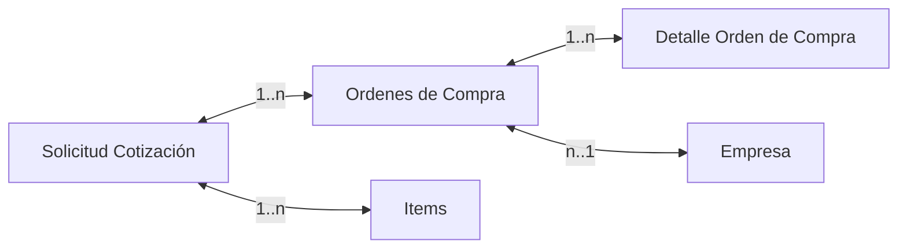
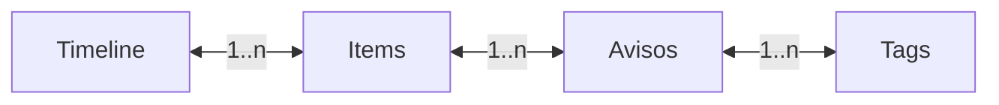

# Moron Parser
Esta solucion permite obtener todas las ordenes de compra para un conjunto de años del Municipio de Morón. La solución está compuesta por 4 proyectos
1. MoronParser: Scrapper y Parser del [portal de compras](https://apps.moron.gob.ar/ext/rafam_portal/compras/concluidas.php) del municipio
2. CEOParser: Scrapper y Parser del [buscador de sociedades del BORA](https://timeline.boletinoficial.gob.ar/)
3. MoronParserTest: Unit tests de MoronParser
4. CEOParserTest: Unit test de CEOParser

También hay un script en Python que hace Scrapping y ejecuta localmente un LLM que parsea el contenido del buscador de sociedades del BORA. El mismo se encuentra en `CEOLLMParser`

## MoronParser 
Este proyecto genera archivos locales en formato `.json` con la siguiente estructura

El modelo se puede encontrar en `SolicitudCotizacion.cs`

## CEOParser
Este proyecto genera archivos locales en formato `.json` con la siguiente estructura

El modelo se puede encontrar en `Timeline.cs` y es el modelo que devuelve el buscador de sociedades del BORA.

## CEOLLMParser
Esta carpeta tiene el script `generateCeoTimeline.py` que toma como entrada el archivo `input_with_bora.csv` y genera uno nuevo con los cambios en las juntas directivas de las empresas.

Esto se logra gracias a que el archivo de entrada tiene el link al extracto del BORA en donde se nombra a la empresa. Este extracto se envía en un prompt personalizado al LLM para que genere el `json` con los cambios de la junta directiva.

El modelo usado es [Orca 2](https://huggingface.co/microsoft/Orca-2-13b), del paper [Orca2: Teaching Small Language Models How to Reason](https://arxiv.org/pdf/2311.11045), en su version cuantizada [Orca-2-13B-GGUF](https://huggingface.co/TheBloke/Orca-2-13B-GGUF).

El script se puede modificar para leer cualquier otro archivo de cualquier otro formato. Realmente lo único que necesita es es link al BORA.
# Pre-requisitos

## MoronParser y CEOParser
Se requiere el .Net runtime y SDK 8. Ambos se pueden descargar [acá](https://dotnet.microsoft.com/en-us/download/dotnet/8.0)

## CEOLLMParser
Python 3.9, ctransformers y bs4. Se puede instalar Python desde la [página oficial](https://www.python.org/downloads/release/python-390/). Luego abrir un terminal y ejecutar

`pip install ctransformers`
`pip install bs4`

# Ejecución

## MoronParser
Abrir un terminal en  `./MoronParser` y ejecutar  
`dotnet run --project .\MoronParser.csproj`

## CEOParser
Abrir un terminal en `./CEOParser` y ejecutar
`dotnet run --project .\CEOParser.csproj`

## CEOLLMParser
Abrir un terminal en `./CEOLLMParser` y ejecutar
`python generateCeoTimeline.py`

# Configuración
En el archivo `./MoronParser/Program.cs` se pueden modificar las variables

* `FROM_YEAR`: El año mínimo inclusive a obtener las solicitudes de cotización
* `TO_YEAR`: El año máximo inclusive a obtener las solicitudes de cotización
* `TARGET_FOLDER`: La carpeta donde se van a guardar las solicitudes de cotización en `.json`. Por defecto es "C:\\CompraConcluida"

En el archivo `./CEOParser/Program.cs` se pueden modificar las variables

* `TARGET_FOLDER`: La carpeta donde se van a guardar los datos de las empresas con sus juntas directivas
* `COMPRAS_FOLDER`: La carpeta donde ya están guardadas las solicitudes de cotización

En el archivo `CEOLLMParser/generateCeoTimeline.py` se pueden modificar todas las varibles para resutlados distintos. A destacar:

* `model_path_or_repo_id` y `model_file`: Para usar un modelo distinto
* `gpu_layers`: Para usar más o menos memoria de GPU. Si este valor es muy alto, el script puede fallar, dependiendo la GPU
* `threads`: Para usar más hilos de la CPU
* `system`: Para modificar el prompt

Los valores por defecto de `generateCeoTimeline.py` generaron los resultados con una precisión del 96% en un equipo con un procesador Ryzen 5 3600g y gpu RTX 3060ti. La generación tardó ~50 segundos de media para los ~1800 casos, lo que son unas 25 horas de ejecución.
